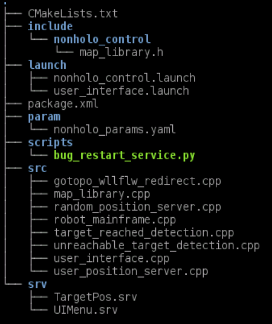

# Research Track 1 - Assignment 2
## Marco Gabriele Fedozzi [S5083365]

### Content description 

The ROS package **nonholo_control** here presented is to be intended as complementar to the 'final_assignment' and 'gmapping' ones,
since all nodes herein are developed in a way that does not require any modification to be made to those ones.
The content of the package is the following:


- **CMakeLists.txt:** the cmake file of the package;
- **map_library.h:** a simple header file for a shared function regarding the usage of a std::map structure;
- **nonholo_control.launch:** one of the two launch files specific to the package, contains 
	the definition of the nodes that relate to the computational part. It includes the re-definition of the
	nodes already presented in the 'final_assignment' launch files; they're directly written 
	(and not simply included), due to the various remappings done to the topics those nodes interface with;
- **user_interface.launch:** the other launch file, inside it are defined the nodes that interface with the
	user and shall thus be run separately from the one constantly printing on video the position of the
	robot;
- **package.xml:** the XML file describing package requisites
- **nonholo_params.yaml:** small parameter file containing variables shared between all the nodes;
- **bug_restart_service.py:** python script that invokes *roslaunch* API to launch (actually restart) a separate node
	(bug_m), the process and the motivations are described later on);
- **gotopo_wllflw_redirect.cpp:** a ServiceServer that forwards service calls for 'go_to_point_switch' and 
	'wall_follower_switch', redirected in the launch file (only when certain conditions are met);
- **map_library.cpp:** the executable for the aforementioned library;
- **random_position_server.cpp:** a ServiceServer generating a random target position among the valid ones;
- **robot_mainframe.cpp:** the central node, it coordinates all smaller tasks performed by other nodes;
- **target_reached_detection.cpp:** a message Publisher that sends a message each time a target is received;
- **unreachable_target_detection.cpp:** detects, in a rather approximative way, whenever the robot is stuck and
	cannot reach its defined goal, publishing a message on a specific topic in that case;
- **user_interface.cpp:** the User Interface, presenting the list of commands that can be issued to the robot;
- **user_position_server.cpp:** similar to *random_position_server.cpp*, however the position here is asked to the
	user (but it still has to be one of the predefined ones);
- **TargetPos.srv:** a service structure defining the target position;
- **UIMenu.srv:** a service structure defining the user choice inserted in the UI;

Please notice that this is but a quick description, a more in depth explanation is contained inside each script.

---

### Computational graph and communications


The graph of this project might seem quite complex at first glance, but many services are just used for quick
event notification (meaning that they're empty services or messages which receival is the important part, not
any data therein). As mentioned, and as can be seen, **robot_mainframe** node is the one with the most connections,
from _'/cmd_vel'_ (and relative remapped versions plus the multiplexer governing them, more on that later), to the 
remapped 'go_to_point' and 'wall_follower' switch, of course both _'/odom'_ and _'/move_base/goal'_ and both the
topics notifying of target reached or unreachable. All other nodes are, for the most part, simply service providers,
although (even if it cannot be seen easily from the graph, since services are not shown) some of them still need to
access other services (such as the **target_reached** node that looks at both the remapped _'/user_interface'_ of the
**bug** node and the _'/move_base/status'_ to track evidences of the goal being reached).

---

### Compiling and running

Both the _'gmapping'_ and _'final_assignment'_ packages are **necessary** to run the package here provided (and thus
required by the CMake file). If all three packages are present on the machine it's sufficient to run 
```bash
# catkin_make
```
in the root directory of the ROS workspace to compile everything.

As mentioned, two separate launch files are included in the package, both need to be run simultaneously on separate shells
in order to control the robot and observe its position. Moreover, the _simulation_gmapping.launch_ file present inside
_'final_assignment'_ package has to be run in another shell window to run both **rviz** and **Gazebo**, necessary for 
the simulation.
```bash
# roslaunch final_assignment simulation_gmapping.launch

# roslaunch nonholo_control nonholo_control.launch

# roslaunch nonholo_control user_interface.launch
```
This specific order of the launch files calls is required, in order to have all nodes execution prerequisites met, and it's
suggested to wait until one of them has finished the startup phase before launching the next one.

---

### Robot behaviour

The robot, as demanded, can move around the environment, going towards one of the 6 goal coordinates allowed, using either
'move_base' or 'bug0' path planning algorithm, accepting new commands each time the previous goal is reached (or the recovery
is enacted). Moreover, it can start following the walls of the environment without a fixed goal, behaviour during which a new 
command can be inserted at any given time. It should be mentioned that, due to the limited capabilities of the
'bug0' algorithm, it's possibile (and rather frequent) that the robots gets stuck in one of the "rooms" in the environment,
following the walls without ever actually managing to move towards the goal. To address that case, however, a simple recovery
behaviour has been implemented, having the robot fall back to the previous target (considered as a safe place) using the 'move_base'
algorithm (which is more robust, already presenting ad-hoc recovery behaviours in case of planning or driving errors) in case more 
than two minutes pass from the definition of a target and its achievement. While the robot is trying to reach a goal its position,
goal and distance between the two are printed on screen (and thus to the log file) enabling the tracking of the system.

---

### Architectural choices made

As mentioned, a peculiar design choice was made before starting this project: no modifications were allowed to the _'final_assignment'_
nor to the _'gmapping'_ packages: this Black Box approach was sought after in order to simulate an industrial environment, where notions
about the tools given may come solely from the observation of the system behaviour, without any knowledge of the inner mechanisms
(for whichever legal or industrial reasson). However, being said packages (_'final_assignment'_ in particular) not designed to be used
in this way, the work that had to be done was quite the challenge and required some non-trivial component to work properly, together with
some "unelegant" (but, I believe, necessary) choice.

The atwo algorithms, 'move_base' and 'bug0', have very different approaches to the problem
- the former basing its behaviour on actions and messages, being able to automatically react to a new goal instance and constantly
	emitting status messages;
- the latter retrieving the target position from a parameter server in specific states of its operation, not being able to react to
	external stimuli;
	
This meant that a lot of the operations and services provided by the **nonholo_control** package have to deal with very different
communication mechanisms, trying to hide this differences (abstracting the inner workings) from the the **robot_mainframe** node,
which has been developed in a way that allows for other planning algorithms to be added with very little modification to the code.
The first problem encountered was to avoid crosstalk on the _'/cmd_vel'_ topic, since both algorithms output a driving 
message tehere by default: for that reason, the velocity output topics of those nodes have been remapped, and a multiplexer has been 
used to shift control over the channel to either of the two, depending on the user preferences. A similar problem was faced when
dealing with the "wall follower" behaviour, to be implemented independently from the planning algorithm used at any given time:
since 'bug_m' would generally control the services for switching on and off the "go_to_point" and "wall_follower" behaviours its
requests had to be silenced while the robot was following the walls by user choice (or it would try to drive the robot back to its
previous target). For this end a service resembling a mutex, but actually closer to a conditional router, was designed and, once
again, the services from the algorithms remapped to retrieve which node made each request.

Finally, what probably constituted the most labour intensive part of the design and debugging process was working around the target
retrieval method of the 'bug_m': as mentioned, this originally happened in two very specific cases, either at the booting of the node
(where two values provided by the parameter server are read) or whenever a previous target was reached, when a call to a user interface
service was made before reading the parameters (which, at the time of the response, would be updated with new values inserted by the 
user via the UI). Unfortunatly, this was not viable since this service call has been used to detect the reaching of a target from
'bug_m' perspective, so the current user interface could not communicate directly with this service. But the response to such service
had to wait until a new target was issued from the user, or 'bug' node would read the target coordinates *before* the update.
A conditional variable, coupled with a mutex, has been used to prevent such service callback to return before a new target was issued 
(detected by reading the _'/move_base/goal'_ topic): however, being all services and topics for the node queued by default in the same
Callback Queue, and being it checked by a single Spinner, using a conditional variable in that service callback would mean block the
entire process, making the system hang indefinitely (since no messages from _'/move_base/goal'_ would be read, thus never modifying
the conditional variable). To avoid this issue a separate Callback Queue, together with an additional spinner run in a new thread of the node,
was designed, so that the blocking of that queue would not prevent all other messages and services calls from being served.
This, however, could not work in all scenarios: whenever a target was deemed unreachable and the recovery behaviour adopted, the target would
fall back to its previous (safe) value, which means the robot changed target without having reached the previous one: in other words,
there is no way of communicating such change to the 'bug' node, which would not recognize the new goal as the valid one, leading to
numerous problems (eg. the bug0 algorithm would not stop, evaluating the proximity with respect to the old goal while being driven towards 
the new one): the only solution found for that was to commpletely restart the 'bug' node, taking advantage of the fact that the first target 
position is retrived at node booting. That's been accomplished using the *roslaunch* API from within a python script to launch a new instance 
of the node (which would by default shut down the previous one). It's by no mean an optimal strategy, but it's the only one that could work 
(at least that I knew of) without modifying the 'bug_m.py' script.

---

### Limitations and improvements

Of course, one main issue related to the approach followed is that the entire project is largely unoptimized, many more services and
checks are implemented with respect to what would have been by modifying few lines of code in the 'bug_m' script. On top of that, the 
recovery behaviour is quite rudimental and, due to the way the system operates, it automatically changes the planning algorithm to 
'move_base', no matter what was used before (but it can easily be reverted back to 'bug0' via the UI once the safe goal is reached).
Even more, having to restart a node to make everything work is generally a strategy to avoid but, since it's technically due to a planning
error, it's not completely inappropriate either: for sure not the most elegant approach.
As a side note, more graphical than anything, once a wall following procedure is started the previous goal is still displayed on 
'rviz', which might confuse an unexperienced user.
Moreover, having always both planners work on each target but reading up only one of the two outputs is surely a waste of resources,
which would need to be optimized in a real world scenario.
Lastly, since the check on a target being reached is leaved to the pre-existing algorithms, the parameters therein define the tolerance
of the final position with respect to the given goal, which can lead to some occasional problem, where the distance from the target would
be just slightly larger than the threshold and both 'bug0' and 'move_base' would need few seconds to stop, even if the robot is not moving 
(but in all tests performed still managed to converge, thanks to 'move_base' target detection). A simple workaround would be to enlarge the
tolerance value in 'bug_m.py' script to something closer to 0.5, which wasn't done here since that value is hardcoded in the script itself.